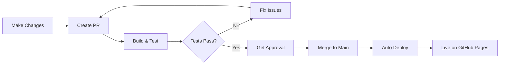

# GitHub Pages Setup Guide

This guide walks you through enabling GitHub Pages for your documentation site. This is a required step to activate automated documentation deployment.

---

## Prerequisites

- Admin access to the GitHub repository
- GitHub Actions workflows committed to the repository
- Documentation build passing locally

---

## Step-by-Step Setup

### Step 1: Navigate to Repository Settings

1. Go to your repository on GitHub: https://github.com/Chunkys0up7/docascode
2. Click the **Settings** tab (top right, next to Insights)

### Step 2: Configure GitHub Pages

1. In the left sidebar, scroll down and click **Pages**
2. Under "Build and deployment":
   - **Source:** Select "GitHub Actions" from the dropdown
   - This enables deployment from our workflow
3. **No other configuration needed** - our workflow handles everything
4. Click **Save** (if there's a save button)

### Step 3: Verify Permissions

GitHub Actions needs write permissions to deploy:

1. Still in Settings, go to **Actions** > **General** (in left sidebar)
2. Scroll to "Workflow permissions"
3. Select **"Read and write permissions"**
4. Check **"Allow GitHub Actions to create and approve pull requests"**
5. Click **Save**

### Step 4: Trigger First Deployment

Now trigger the deployment workflow:

**Option A: Merge Current Branch**
```bash
# If you're ready to merge your current work
git checkout main
git merge claude/docs-as-code-plan-011CV2T4yq7YmkQ3oyt25Tip
git push origin main
```

**Option B: Manual Trigger**
1. Go to **Actions** tab in GitHub
2. Click "Deploy Documentation to GitHub Pages" workflow
3. Click **Run workflow** dropdown
4. Select **main** branch
5. Click **Run workflow** button

**Option C: Push to Main**
```bash
# Create a small change on main
git checkout main
echo "\n" >> README.md
git commit -am "docs: trigger initial deployment"
git push origin main
```

### Step 5: Monitor Deployment

1. Go to **Actions** tab
2. You should see "Deploy Documentation to GitHub Pages" running
3. Click on the workflow run to see progress
4. Wait for green checkmarks (takes 2-3 minutes)

### Step 6: Access Your Documentation

Once deployment completes:

1. Go back to **Settings** > **Pages**
2. You'll see a message: **"Your site is live at https://chunkys0up7.github.io/docascode/"**
3. Click the link or visit: https://chunkys0up7.github.io/docascode/
4. Your documentation is now live!

---

## Verification Checklist

After setup, verify everything works:

- [ ] GitHub Pages source set to "GitHub Actions"
- [ ] Workflow permissions set to "Read and write"
- [ ] First deployment workflow completed successfully
- [ ] Documentation site accessible at GitHub Pages URL
- [ ] Navigation works correctly
- [ ] All pages load without errors
- [ ] Search functionality works

---

## Custom Domain (Optional)

If you want to use a custom domain:

### Step 1: DNS Configuration

Add DNS records with your domain provider:

**For apex domain (example.com):**
```
A     @     185.199.108.153
A     @     185.199.109.153
A     @     185.199.110.153
A     @     185.199.111.153
```

**For subdomain (docs.example.com):**
```
CNAME docs  chunkys0up7.github.io
```

### Step 2: Configure in GitHub

1. Go to **Settings** > **Pages**
2. Under "Custom domain", enter your domain
3. Click **Save**
4. Wait for DNS check (can take up to 24 hours)
5. Once verified, enable **"Enforce HTTPS"**

### Step 3: Update MkDocs Configuration

Update `mkdocs.yml`:

```yaml
site_url: https://docs.example.com  # Your custom domain
```

Commit and push to redeploy.

---

## Troubleshooting

### Issue: "GitHub Pages is not enabled"

**Symptoms:** Can't find Pages option in Settings

**Solutions:**
1. Ensure repository is public (or you have GitHub Pro/Team)
2. Check you have admin access to the repository
3. Try refreshing the GitHub settings page

### Issue: "Workflow failed with 403 error"

**Symptoms:** Deployment workflow fails with permissions error

**Solutions:**
1. Check workflow permissions (Step 3 above)
2. Ensure "Read and write permissions" is selected
3. Re-run the workflow after fixing permissions

### Issue: "Site shows 404"

**Symptoms:** GitHub Pages URL returns 404 Not Found

**Solutions:**
1. Wait 5-10 minutes after first deployment
2. Check deployment workflow completed successfully
3. Verify source is set to "GitHub Actions"
4. Check site_url in mkdocs.yml is correct
5. Look for errors in Actions workflow logs

### Issue: "Pages build and deployment workflow not found"

**Symptoms:** GitHub says it can't find deployment workflow

**Solutions:**
1. Ensure `.github/workflows/docs-deploy.yml` exists in main branch
2. Check the workflow file syntax is valid
3. Ensure you've pushed the workflows to main branch
4. Try creating a new commit to trigger workflow

### Issue: "Deployment succeeds but site doesn't update"

**Symptoms:** Changes not reflected on live site

**Solutions:**
1. Clear browser cache (Ctrl+Shift+R / Cmd+Shift+R)
2. Check the deployment workflow ran for your latest commit
3. Verify the commit SHA in deployment matches your latest commit
4. Wait a few minutes for CDN cache to clear

---

## Branch Protection Setup

After GitHub Pages is working, set up branch protection:

### Step 1: Create Protection Rule

1. Go to **Settings** > **Branches**
2. Click **Add rule** (or **Add branch protection rule**)
3. In "Branch name pattern", enter: `main`

### Step 2: Configure Rules

Enable these protections:

**Pull Request Requirements:**
- [x] Require a pull request before merging
- [x] Require approvals: **1**
- [x] Dismiss stale pull request approvals when new commits are pushed

**Status Checks:**
- [x] Require status checks to pass before merging
- [x] Require branches to be up to date before merging
- Search for and select: **build-and-test**

**Additional Settings:**
- [x] Do not allow bypassing the above settings
- [ ] Allow force pushes (leave unchecked)
- [ ] Allow deletions (leave unchecked)

### Step 3: Save

1. Scroll down and click **Create** (or **Save changes**)
2. Branch protection is now active

### Step 4: Test Protection

1. Create a test branch and PR
2. Try to merge without approval - should be blocked
3. Try to merge with failing checks - should be blocked
4. Approve PR with passing checks - should merge successfully

---

## Automated Deployment Workflow

Once set up, this is the automated workflow:



**What happens automatically:**

1. **On PR:** Build workflow runs, validates docs
2. **On Merge to Main:** Deploy workflow runs
3. **Deployment:** Site updates within 2-3 minutes
4. **Notification:** Green checkmark shows success

---

## Maintenance

### Regular Checks

**Weekly:**
- Monitor deployment success rate
- Check for broken links
- Review dependency updates from Dependabot

**Monthly:**
- Review GitHub Actions usage
- Update dependencies
- Audit documentation quality

### Updating Documentation

**Standard workflow:**
```bash
# Create feature branch
git checkout -b docs/your-update

# Make changes
# ... edit files ...

# Test locally
mkdocs serve

# Commit and push
git add .
git commit -m "docs: description of changes"
git push origin docs/your-update

# Create PR on GitHub
# Wait for checks to pass
# Get approval
# Merge - auto-deploys!
```

---

## Next Steps

After GitHub Pages is set up:

1. ✅ Verify documentation is live
2. ✅ Configure branch protection
3. ✅ Share documentation URL with team
4. ✅ Create first documentation PR as test
5. ✅ Move to Week 2 tasks

See [Week 1 Progress](WEEK1_PROGRESS.md) for status and [Implementation Checklist](site_docs/implementation-checklist.md) for next steps.

---

## Support

### Resources

- [GitHub Pages Documentation](https://docs.github.com/en/pages)
- [GitHub Actions Documentation](https://docs.github.com/en/actions)
- [MkDocs Deployment Guide](https://www.mkdocs.org/user-guide/deploying-your-docs/)
- [Material Theme Publishing Guide](https://squidfunk.github.io/mkdocs-material/publishing-your-site/)

### Getting Help

- Check Actions tab for workflow logs
- Review troubleshooting section above
- Consult [Quick Start Guide](site_docs/quick-start-guide.md)
- Open an issue in the repository

---

## Summary

**Setup Time:** ~10 minutes
**Deployment Time:** 2-3 minutes per update
**Manual Steps:** Only initial setup
**Ongoing Effort:** Zero (fully automated)

Once configured, documentation deploys automatically on every merge to main. No manual intervention required!
