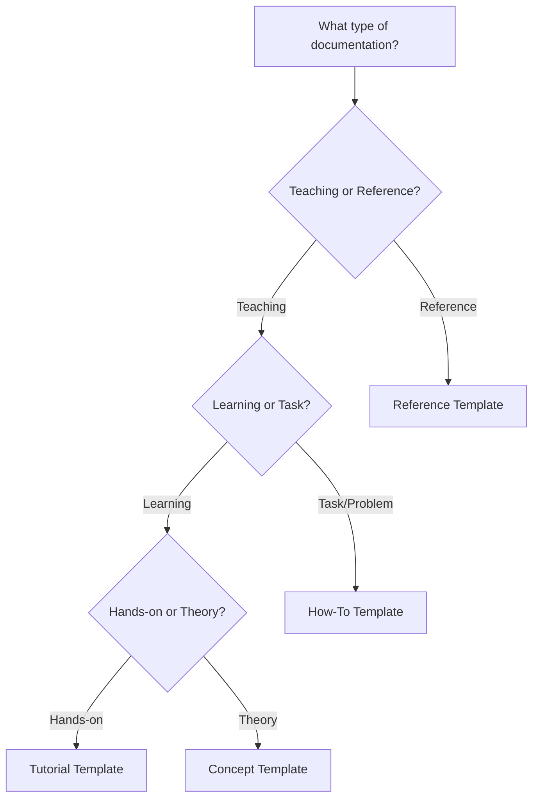

# Documentation Templates

Use these templates to create consistent, high-quality documentation. Each template is designed for a specific documentation type.

---

## Available Templates

### 1. Concept Template
**File:** [`concept-template.md`](concept-template.md)

**Use when:**
- Explaining WHAT something is
- Describing WHY it exists
- Teaching theory or principles
- Providing background understanding

**Examples:**
- "What is a Knowledge Graph?"
- "Understanding Procedure Generation"
- "MCP Integration Concepts"

[**Download Template**](concept-template.md){ .md-button }

---

### 2. Tutorial Template
**File:** [`tutorial-template.md`](tutorial-template.md)

**Use when:**
- Teaching through hands-on practice
- Building something concrete step-by-step
- Providing a learning experience
- Taking users from start to finish

**Examples:**
- "Tutorial: Build Your First Dynamic Procedure"
- "Tutorial: Set Up Graph-Based Documentation"
- "Tutorial: Create a Custom Underwriting Workflow"

[**Download Template**](tutorial-template.md){ .md-button }

---

### 3. How-To Guide Template
**File:** [`howto-template.md`](howto-template.md)

**Use when:**
- Solving a specific problem
- Accomplishing a particular task
- Providing goal-oriented instructions
- Answering "How do I...?" questions

**Examples:**
- "How to Configure Authentication"
- "How to Deploy to Production"
- "How to Troubleshoot Graph Errors"

[**Download Template**](howto-template.md){ .md-button }

---

### 4. Reference Documentation Template
**File:** [`reference-template.md`](reference-template.md)

**Use when:**
- Documenting API endpoints
- Describing CLI commands
- Listing configuration options
- Providing technical specifications

**Examples:**
- "API Reference: Generate Procedure"
- "CLI Reference: docs command"
- "Configuration Reference: mkdocs.yml"

[**Download Template**](reference-template.md){ .md-button }

---

## Quick Selection Guide

Use this flowchart to choose the right template:



**Quick Decision Tree:**

1. **Is it reference material?** (API, CLI, Config)
   → Use **Reference Template**

2. **Does it solve a specific problem?** (How do I...?)
   → Use **How-To Template**

3. **Does it teach by building something?** (Tutorial)
   → Use **Tutorial Template**

4. **Does it explain what/why?** (Understanding)
   → Use **Concept Template**

---

## Documentation Types Explained

### Concepts (Understanding-Oriented)
**Focus:** Knowledge and understanding
**Question:** "What is X and why does it exist?"
**Tone:** Explanatory and educational
**Length:** 500-1500 words
**Example:** Explaining what a knowledge graph is

### Tutorials (Learning-Oriented)
**Focus:** Learning by doing
**Question:** "Can you teach me to...?"
**Tone:** Friendly and encouraging
**Length:** 1000-3000 words
**Example:** Building your first procedure from scratch

### How-To Guides (Problem-Oriented)
**Focus:** Achieving a goal
**Question:** "How do I...?"
**Tone:** Direct and action-oriented
**Length:** 300-1000 words
**Example:** How to configure a specific setting

### Reference (Information-Oriented)
**Focus:** Technical accuracy
**Question:** "What are the details of...?"
**Tone:** Neutral and precise
**Length:** Varies (comprehensive)
**Example:** Complete API endpoint documentation

---

## Using the Templates

### 1. Choose Your Template

Select the appropriate template based on your documentation needs.

### 2. Copy the Template

```bash
# Copy template to new location
cp site_docs/contributing/templates/[template-name].md site_docs/[category]/[your-doc-name].md
```

### 3. Fill in the Template

- Replace all `[placeholders]` with actual content
- Delete sections that don't apply
- Add sections as needed
- Follow the inline comments and guidelines

### 4. Review Checklist

- [ ] All placeholders replaced
- [ ] Frontmatter completed
- [ ] Appropriate tone and style
- [ ] Code examples tested
- [ ] Links functional
- [ ] Images added (if applicable)
- [ ] Follows [Style Guide](../style-guide.md)

### 5. Submit for Review

Create a pull request following the [Contributing Guide](../index.md).

---

## Template Customization

### When to Customize

Templates are starting points. Customize them when:
- Your content has unique requirements
- Standard sections don't fit your needs
- You need additional specialized sections

### What to Keep

Always keep these elements:
- Frontmatter with metadata
- Clear title and description
- Logical structure and headings
- Examples and code blocks
- Links to related documentation

### What to Change

Feel free to modify:
- Section order (if it improves flow)
- Section names (for clarity)
- Number of examples
- Level of detail
- Additional sections

---

## Common Patterns

### Frontmatter

All templates include standard frontmatter:

```yaml
---
title: [Clear, descriptive title]
description: [One-line description]
date: YYYY-MM-DD
tags:
  - [template-type]
  - [relevant-tags]
status: draft | review | published
---
```

### Code Blocks

Always specify the language:

```markdown
```python
# Your code here
```
```

### Admonitions

Use for important information:

```markdown
!!! note
    Additional information

!!! tip
    Helpful suggestion

!!! warning
    Important caution

!!! danger
    Critical warning
```

### Links

Use relative links for internal documentation:

```markdown
[Link text](../category/page.md)
```

---

## Examples of Each Type

### Concept Example
- **Title:** "Understanding Knowledge Graphs"
- **Purpose:** Explain what knowledge graphs are and why they're useful
- **Structure:** What is it? → Why use it? → How it works → Related concepts

### Tutorial Example
- **Title:** "Tutorial: Build a Document Processor"
- **Purpose:** Teach by building a complete, working processor
- **Structure:** What you'll build → Prerequisites → Step-by-step → Test → Next steps

### How-To Example
- **Title:** "How to Configure SSL Certificates"
- **Purpose:** Solve the specific problem of SSL configuration
- **Structure:** Problem → Prerequisites → Steps → Verification → Troubleshooting

### Reference Example
- **Title:** "API Reference: /api/generate"
- **Purpose:** Complete technical specification of the endpoint
- **Structure:** Syntax → Parameters → Return values → Examples → Notes

---

## Quality Standards

All documentation using these templates should meet:

- ✅ **Clarity:** Easy to understand for the target audience
- ✅ **Completeness:** All necessary information included
- ✅ **Accuracy:** Technically correct and tested
- ✅ **Consistency:** Follows templates and style guide
- ✅ **Examples:** Working code examples included
- ✅ **Links:** References to related documentation

---

## Getting Help

### Questions About Templates?

- Check the [Style Guide](../style-guide.md)
- Review [Contributing Guidelines](../index.md)
- Ask in team chat or create an issue
- Look at existing documentation for examples

### Template Improvements

Have ideas to improve these templates?

1. Create an issue describing the improvement
2. Submit a PR with proposed changes
3. Discuss with the documentation team

---

## Related Resources

- [Contributing Guide](../index.md) - How to contribute documentation
- [Style Guide](../style-guide.md) - Writing standards and conventions
- [Quick Start Guide](../../quick-start-guide.md) - Getting started with Week 1
- [Implementation Roadmap](../../implementation-roadmap.md) - Overall strategy

---

## Template Maintenance

**Last Updated:** 2025-11-11
**Maintained By:** Documentation Team
**Version:** 1.0.0

These templates are living documents. They'll be updated based on:
- Team feedback
- Usage patterns
- Best practice evolution
- Tool and workflow changes

---

**Ready to write documentation? Choose your template above and start creating!**
